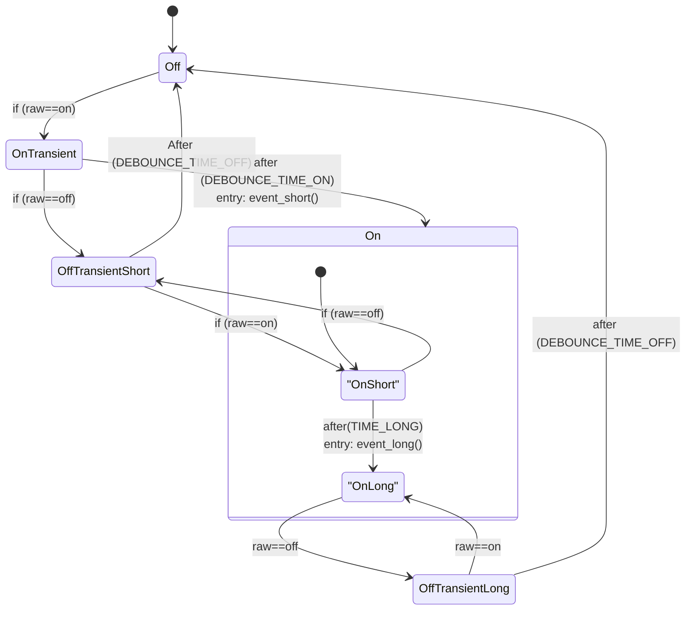

```mermaid
stateDiagram
[*] --> Off
  Off --> OnTransient: if (raw==on)
  OnTransient --> OffTransientShort: if (raw==off)
  OffTransientShort --> OnShort:if (raw==on)
  state On {
                [*] --> OnShort
                OnLong
            }

  OnTransient --> On: after (DEBOUNCE_TIME_ON)<br>entry#colon; event_short()
  OnShort -->OffTransientShort: if (raw==off)
  OnShort--> OnLong: after(TIME_LONG)<br>entry#colon; event_long()
  OffTransientShort -->Off: After (DEBOUNCE_TIME_OFF)
  OnShort: "OnShort"
  OnLong: "OnLong"
  OnLong --> OffTransientLong: raw==off
  OffTransientLong --> OnLong: raw==on
  OffTransientLong --> Off: after (DEBOUNCE_TIME_OFF)
```
